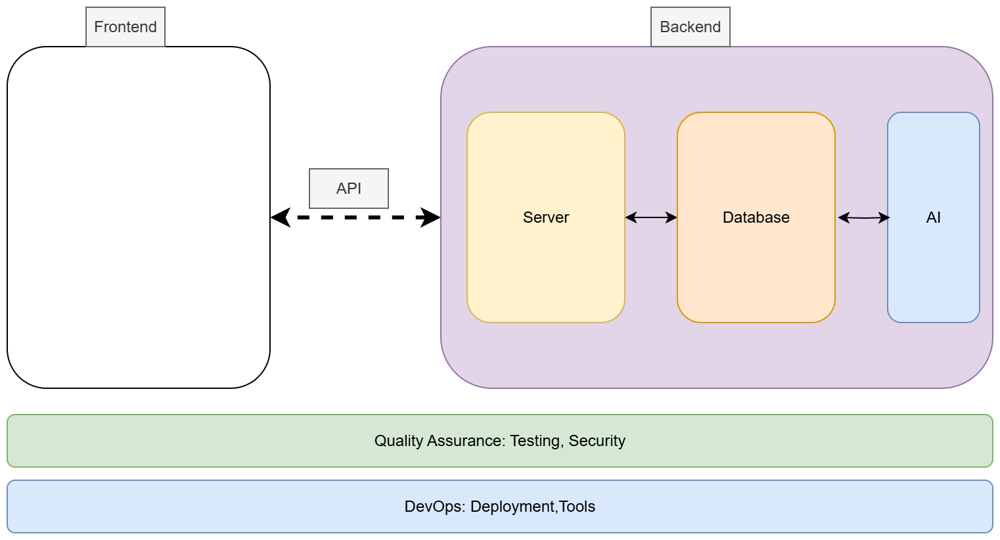

# E‑commerce Store with Admin Dashboard

> [!NOTE]  
> Note: The following project is provided as a suggested starting point. Your group may choose to use it as‑is, adapt and extend it, or take inspiration from it to create something entirely new. It is meant to support your brainstorming process, not to limit your creativity.

### About the Project

This project is based on the [E‑commerce Product Page challenge](https://www.frontendmentor.io/challenges/ecommerce-product-page-UPsZ9MJp6) from Frontend Mentor. The original challenge provides a professional product page design with features such as a product gallery, cart functionality, and responsive layouts. You will adapt this layout and extend it into a **full‑stack MERN e‑commerce platform** with a complete shopping experience and an **admin dashboard** for managing products, users, and orders.

---

### Business Goals

- Provide **dynamic product listings** with cart and checkout functionality.  
- Differentiate with **AI‑powered features**, such as product description generation, personalized recommendations, and smart search.  
- Support both **customers** (who browse and purchase products) and **administrators** (who manage inventory, users, and system health).  

---

### Target Users

1. **Customers** who browse products, add them to the cart, and complete purchases.  
2. **Store administrators** who manage product listings, track orders, and oversee user accounts.  
3. **Business managers** who need insights into sales and customer behavior.  

---

### Development Phases (aligned with sprints)

- **Sprint 1**: Create a **Figma prototype** and write **user stories**. See [course materials](https://github.com/tx00-web-en/Project/blob/main/material/sprint1.md) for detailed deliverables.
- **Sprint 2**: Build the **UI** (adapting the provided layout) and implement **basic backend functionality** such as product CRUD operations and cart management.  
- **Sprint 3**: Add **user administration**, integrate **LLM features** (recommendations, product descriptions), and perform **testing**.  

---

### You Don’t Start from Scratch

To reduce stress around UI design, you are not expected to design everything yourself. Instead, you can **adapt the provided layout**:

- Challenge link: [E‑commerce Product Page](https://www.frontendmentor.io/challenges/ecommerce-product-page-UPsZ9MJp6)  

> You may look at existing solutions for inspiration, but you must **clearly document** what you reused and what you modified. You will also need to extend the layout with additional views (e.g., product management dashboard, checkout flow) and an **LLM interface**, so your final product will go beyond the starter design.

---

### How This Can Be Used as a Full‑Stack Project

Although the challenge begins as a single product page, you will transform it into a **full‑stack MERN e‑commerce store** by adding functionality such as:

- **User accounts and authentication** (MongoDB + Express + React + Node.js)  
- **Product management** (create, edit, delete, and display products dynamically)  
- **Shopping cart and checkout** with persistent storage  
- **Order management** for tracking purchases  
- **LLM integration**:  
  - Generate AI‑based product descriptions  
  - Provide personalized product recommendations  
  - Enhance search with natural language queries  
- **Admin dashboard** for managing products, users, and orders  

---

### Workload Distribution

To ensure balanced contributions, each group should assign roles clearly e.g **One or two members** focusing on **UI/UX** (adapting the layout, ensuring usability). This includes **Figma prototyping** in Sprint 1.  

This division ensures that design, prototyping, and technical implementation all progress in parallel.

---

