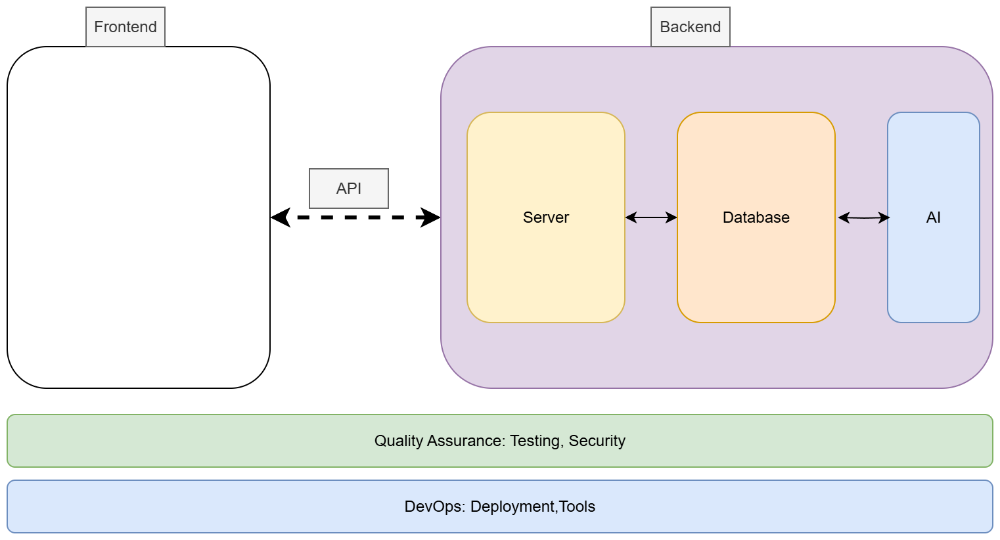

# Job Listings with Filtering

> [!NOTE]  
> Note: The following project is provided as a suggested starting point. Your group may choose to use it as‑is, adapt and extend it, or take inspiration from it to create something entirely new. It is meant to support your brainstorming process, not to limit your creativity.

### About the Project

This project is based on the [Job Listings with Filtering challenge](https://www.frontendmentor.io/challenges/job-listings-with-filtering-ivstIPCt) and can be extended with ideas from the more advanced [DevJobs Web App challenge](https://www.frontendmentor.io/challenges/devjobs-web-app-HuvC_LP4l).  

The original challenge provides a job board design where users can view job postings and filter them by categories such as role, level, languages, and tools. You will adapt this layout and extend it into a **full‑stack MERN application** with persistent data, user accounts, and AI‑powered enhancements.
 
---

### Business Goals

- Deliver a **modern, responsive job board** where users can browse and filter job listings.  
- Provide **dynamic filtering** and search to help users quickly find relevant jobs.  
- Differentiate with **AI‑powered features**, such as resume‑to‑job matching, smart job recommendations, and AI‑generated job summaries.  
- Support both **job seekers** (who browse and apply for jobs) and **administrators** (who manage postings, users, and system health).  

---

### Target Users

1. **Job seekers** who want to browse, filter, and apply for relevant job opportunities.  
2. **Employers** who want to post and manage job listings.  
3. **Administrators** who oversee user accounts, postings, and platform performance.  

---

### Development Phases (aligned with sprints)

- **Sprint 1**: Create a **Figma prototype** and write **user stories**. See [course materials](https://github.com/tx00-web-en/Project/blob/main/material/sprint1.md) for detailed deliverables.
- **Sprint 2**: Build the **UI** (adapting the provided layout) and implement **basic backend functionality** such as job CRUD operations and filtering.  
- **Sprint 3**: Add **user administration**, integrate **LLM features** (recommendations, summaries, matching), and perform **testing**.  

---

### You Don’t Start from Scratch

To reduce stress around UI design, you are not expected to design everything yourself. Instead, you can **adapt the provided layouts**:

- Challenge link: [Job Listings with Filtering](https://www.frontendmentor.io/challenges/job-listings-with-filtering-ivstIPCt)  
- Advanced option: [DevJobs Web App](https://www.frontendmentor.io/challenges/devjobs-web-app-HuvC_LP4l)  

You may look at existing solutions for inspiration, but you must **clearly document** what you reused and what you modified. You will also need to extend the layout with additional views (e.g., job posting form, user dashboard) and an **LLM interface**, so your final product will go beyond the starter design.

---

### How This Can Be Used as a Full‑Stack Project

Although the challenge begins as a front‑end filtering exercise, you will transform it into a **full‑stack MERN job platform** by adding functionality such as:

- **User accounts and authentication** (MongoDB + Express + React + Node.js)  
- **Job management** (create, edit, delete, and display job postings dynamically)  
- **Filtering and search** with multiple criteria (role, level, skills, tools)  
- **LLM integration**:  
  - Match resumes to job postings automatically  
  - Generate AI‑based summaries of job descriptions  
  - Suggest personalized job recommendations  
- **Admin dashboard** for managing users, postings, and analytics  

---

### Workload Distribution

To ensure balanced contributions, each group should assign roles clearly e.g **One or two members** focusing on **UI/UX** (adapting the layout, ensuring usability). This includes **Figma prototyping** in Sprint 1.  

This division ensures that design, prototyping, and technical implementation all progress in parallel.

---

