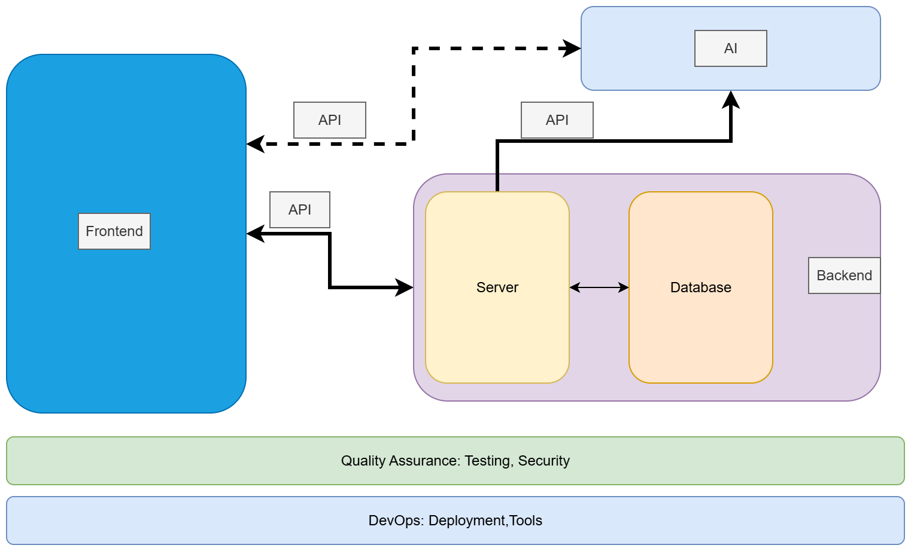

# Sprint 1: Deadline 2025-09-05

- [Deliverables](#deliverables)
- [Assessment Criteria](#assessment-criteria)
- [Considerations](#considerations)
- [Block Diagram Fullstack Application](#block-diagram-fullstack-application)
- [Project Ideas](#project-ideas)

---

### Deliverables

1. Prototype:
   - [Low-fidelity]
   - Tools: [Figma](https://www.figma.com/) or [Draw.io](https://app.diagrams.net/) 
2. Project description:
   - The title of the project
   - The names of the members
   - The target users and other stakeholders
   - The main functionality of the application.
   - Describe the user stories and Product backlog: You might consider using [Trello](https://trello.com/) 
3. Share your insights on the Sprint ceremonies:
   - Daily Scrum
   - Sprint Review
   - Retrospective
   - More on [Scrum](https://www.scrum.org/learning-series/what-is-scrum/)
4. Make sure to include each member’s contributions to this sprint.
5. Presentation: Here’s a [template for a 10-12-minute presentation](./ppt-template.md) to help you structure your content effectively.

> When a group presents their sprint, two other groups will be assigned to ask questions and engage with the presentation.

### Assessment Criteria 

For the first sprint, the assessment criteria are not stringent. Groups can earn the maximum points by **making a 10-12-minute group presentation** and **submitting the required deliverables** to GitHub.

Bonus points can be earned if:
- The product backlog is generated according to the DEEP principle.
- User stories are based on the INVEST principle.
- The use of [Retrospective templates](https://agilebox.app/blog/4ls-retrospective/)

### Considerations

- When working with Figma, consider saving a local copy of the Figma file.
  - *You can save a local copy of a file in the .fig (Figma Design), .jam (FigJam), or .deck (Figma Slides) formats: `File > Save local copy `*
- Utilize [Trello](https://trello.com/) to organize user stories and manage the product backlog.
- Consider using LLM e.g ChatGPT for:
  - Generating user stories and evaluating them in alignment with the **INVEST** principle
  - Constructing a product backlog and Assessing tasks with respect to the **DEEP** principle

### Block Diagram Fullstack Application

### Project Ideas

> **If you don’t already have a project idea**, you can pick one of the following MERN fullstack + AI-powered applications as your project::

1. **AI-Powered Task Management App**: Build a **MERN fullstack task management system** where users can register, log in, and manage tasks (CRUD + deadlines + completion tracking). Integrate an **LLM API** to allow natural language task creation (e.g., “Remind me to finish homework tomorrow at 5 PM”) and provide AI-generated task prioritization or daily summaries.

2. **AI-Enhanced E-commerce Platform**: Develop a **MERN fullstack e-commerce site** with user authentication, product browsing, cart, and checkout. Connect to an **LLM API** for natural language product search (“Find me budget-friendly wireless headphones”), AI-generated product recommendations, and smart descriptions.

3. **AI Blogging Platform**: Create a **MERN blogging application** where users can write, edit, and delete blog posts, with authentication and commenting. Integrate **LLM API calls** to help generate blog post drafts, summarize long posts into short highlights, and moderate spam/toxic comments.

4. **AI-Powered Social Media Clone**: Build a **MERN fullstack social platform** (mini Twitter/Instagram) with posts, likes, comments, follows, and profiles. Use an **LLM API** for AI-generated captions/hashtags, smart feed ranking (semantic similarity), and content moderation.

5. **AI Personal Finance Tracker**: Implement a **MERN app** where users log income and expenses with visualizations. Add **LLM API integration** to automatically categorize spending from descriptions, explain monthly financial trends in plain English, and generate savings tips.

6. **AI Recipe Sharing & Cooking Assistant**: Create a **MERN recipe-sharing platform** where users post and search recipes. Extend it with an **LLM API** so users can input available ingredients (“I have rice, eggs, and spinach”) and receive AI-generated recipes, substitution suggestions, and nutrition summaries.

7. **AI Fitness Tracking App**: Build a **MERN fullstack fitness app** where users track workouts, goals, and progress. Connect to an **LLM API** to generate personalized workout plans, interpret logged workouts in natural language, and provide motivational summaries.

8. **AI Job Board & Career Assistant**: Develop a **MERN job board platform** where employers post jobs and seekers apply. Add **LLM API features** like resume/job matching, AI-generated resume improvement suggestions, and an interview-prep chatbot.

9. **AI Language Learning Tutor**: Create a **MERN language learning platform** with vocab practice, flashcards, and progress tracking. Use an **LLM API** to provide conversational practice with an AI tutor, personalized quizzes, and grammar/writing feedback.

<!-- Links -->
[Low-fidelity]:https://www.invisionapp.com/inside-design/low-fi-vs-hi-fi-prototyping/ 

<!-- 
user stories referred to as tickets:
https://www.jacobparis.com/content/agile-ticketing 
-->

<!--  -->