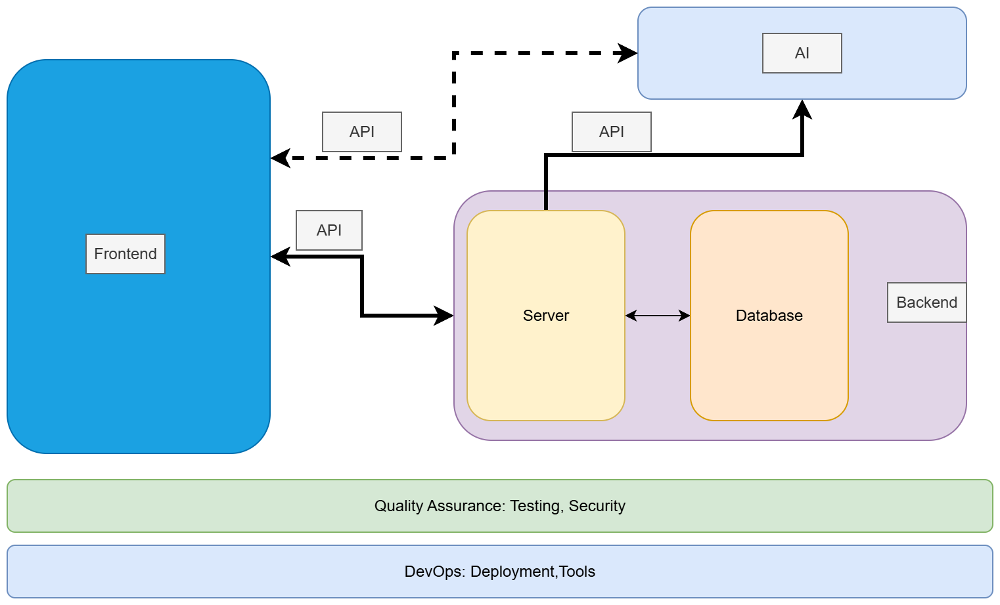

# Sprint 1 — Product Discovery and Prototype

**Duration:** 2 weeks
**Deadline:** 2026-09-03

### Sprint Goal

The goal of Sprint 1 is to transform your initial idea into a clear product concept and create a **low-fidelity prototype of the core user experience**.

During this Sprint, your team will also establish how you will work together as a Scrum team and prepare the skills and tools needed for the next Sprint.

The three Sprints are connected:

* **Sprint 1:** Define the product and create a prototype.
* **Sprint 2:** Transform the prototype into a React-based user interface, without application logic. Add backend services.
* **Sprint 3:** Integrate the application and Add functionalities

> Your Sprint 1 prototype will therefore become an important reference for Sprint 2.

---
# Context and Scope

### Important: What is Sprint 1 about?

This course consists of **three Sprints**, and the focus of each Sprint is different.

**Sprint 1 is a prototyping and product-discovery Sprint.**

At this stage, you are not yet expected to know React, the MERN stack, or all of the technologies required to build the final application. Therefore, Sprint 1 is **not about implementing the application**.

The main purpose of Sprint 1 is to:

* understand the problem you want to solve;
* identify your target users;
* define the core user experience;
* create and validate a low-fidelity prototype;
* receive feedback from the client/Product Owner;
* establish your Scrum team and way of working;
* prepare yourselves technically for the next Sprints.

In later Sprints, the prototype will become the basis for implementation:

**Sprint 1 → Prototype and validation**
**Sprint 2 → React UI, backend**
**Sprint 3 → Application functionality, backend, AI, and integration**

### What does the Sprint 1 backlog look like?

Because Sprint 1 focuses on prototyping rather than implementation, you may have only a small number of traditional product user stories.

For example, two central stories might be:

**1. Client/user prototype**

As a client/user, I need a prototype of the core experience, so that I can evaluate the proposed solution and provide feedback.

**2. Client/Product Owner review**

As a client/Product Owner, I need to review the prototype and provide feedback, so that the team can validate and improve the product concept.

These stories can be supported by technical, learning, and preparation tasks such as:

* learning Figma or another prototyping tool;
* learning CSS and responsive design;
* learning Tailwind CSS;
* exploring React and the technologies that will be needed in Sprint 2;
* learning Git/GitHub;
* exploring AI development tools such as Codex CLI or Gemini CLI;
* investigating technologies that the team may need in later Sprints;
* preparing the project repository and development environment.

**These learning and technical activities are part of the work needed to achieve the Sprint Goal.**

Do not feel that you need to invent a large number of artificial user stories simply to make the backlog look bigger. The backlog should reflect the **actual work and learning required during Sprint 1**.

The Product Backlog will evolve substantially as you learn more about the product and the technology. The backlog you create in Sprint 1 is therefore an **initial and evolving Product Backlog**, not a complete specification of the final application.

---

# 1. Product Idea

Your team should identify a problem that you would like to solve with a full-stack application.

You may:

* develop your own idea;
* adapt one of the suggested project ideas;
* combine ideas;
* propose a completely different application.

Before beginning development, make sure your team can clearly explain:

* What problem are you solving?
* Who are your target users?
* Why would they use your application?
* What value does your application provide?

### Project description

Your project description should include:

* Project title
* Team members
* Target users
* Other relevant stakeholders
* Problem being addressed
* Product vision
* Main functionality of the application

---

# 2. Scrum Team and Responsibilities

At the beginning of the Sprint, establish your Scrum team.

Your team should identify:

### Product Owner

The Product Owner is responsible for maximizing the value of the product and for ordering the Product Backlog.

Discuss and agree on who will take this role in your team.

### Scrum Master

The Scrum Master helps the team understand and apply Scrum and helps address problems that prevent the team from progressing.

Discuss and agree on who will take this role in your team.

### Developers

The remaining team members form the Developers.

The Developers are responsible for creating the product increment and deciding how the work will be accomplished.

---

## Learning and Technical Responsibilities

Sprint 1 is also a preparation period for Sprint 2.

Identify which skills your team will need for the next stage of the project.

For example:

* Figma / prototyping
* AI/API integration
* CSS/Tailwind CSS
* DevOps, Git/GitHub

Team members may take the lead in learning different areas.

For example, one team member may take the lead in learning **Figma**, while another starts becoming familiar with **CSS/Tailwind**, because this knowledge will be useful when the team converts the prototype into a React UI during Sprint 2.

These are **learning responsibilities, not permanent job titles**. The whole team should understand the product and be able to collaborate across areas.

---

# 3. Product Backlog

Identify the main functionality your application will need and express it as **user stories**.

Use the format:

> **As a [user], I need [function], so that [benefit].**

For example:

> As a student, I need to search for available courses, so that I can find courses relevant to my interests.

Create an initial Product Backlog containing the user stories you believe your product may need.

Your Product Backlog should be managed using a tool such as [Trello](https://trello.com/).

You may also use another appropriate tool if your team has a good reason to do so, e.g such as familiarity with [jira](https://www.atlassian.com/software/jira).

Consider:

* prioritization;
* dependencies;
* the value of each story;
* whether stories are sufficiently small and understandable;
* whether stories can eventually be tested.

### Optional challenge

Try to demonstrate the **INVEST** characteristics when writing your user stories:

* Independent
* Negotiable
* Valuable
* Estimable
* Small
* Testable

Also consider whether your Product Backlog follows the **DEEP** principles:

* Detailed appropriately
* Emergent
* Estimated
* Prioritized

These are recommended as learning goals but are not strict requirements for Sprint 1.

---

# 4. Sprint Planning

Before beginning the Sprint work, conduct Sprint Planning.

During Sprint Planning, agree on:

### Sprint Goal

What do you want to achieve by the end of Sprint 1?

For example:

> "Create a prototype that demonstrates how a student can search for a course, view course details, and register for the course."

### Sprint Backlog

Select the Product Backlog items that the team believes it can accomplish during Sprint 1.

The Sprint Backlog should contain:

* the selected user stories;
* the tasks needed to complete them;
* the plan for producing the prototype.

Remember:

> The Product Backlog represents the broader set of work that may be needed for the product.

> The Sprint Backlog represents the work selected for the current Sprint.

---

# 5. Low-Fidelity Prototype

Create a **low-fidelity prototype** demonstrating the core user journey represented by your Sprint 1 user stories.

### Recommended tool: Figma

[Figma](https://www.figma.com/) is strongly encouraged because it is well suited for collaborative prototyping.

Resources will be provided.

However, **Figma is not mandatory**.

You may use another appropriate tool, such as [Draw.io](https://app.diagrams.net/), if your team prefers.

The important requirement is not the tool. The prototype should clearly communicate:

* the main screens;
* the user flow;
* navigation between screens;

### Focus on functionality, not visual polish

You are creating a low-fidelity prototype.

Do not spend most of your Sprint trying to make the interface look like a finished commercial application.

The prototype should answer:

> **"How will a user interact with our application?"**

rather than:

> **"How beautiful is our application?"**

---

# 6. Scrum Events

During the two-week Sprint, your team should practice the Scrum events.

## Sprint Planning

Document:

* Sprint Goal
* Selected Product Backlog items
* Sprint Backlog
* Initial plan

## Daily Scrum

Hold regular Daily Scrums during the Sprint.

The purpose is to inspect progress toward the Sprint Goal and adapt the plan when necessary.

You may use a simple structure such as:

* What have I done?
* What will I work on next?
* Is anything blocking my progress?

The Daily Scrum should be a short coordination event, not a status report to the Scrum Master.

## Sprint Review

At the end of the Sprint, demonstrate your prototype.

Discuss:

* What did you plan to accomplish?
* What did you actually accomplish?
* Which user stories were completed?
* What did you learn?
* What feedback did you receive?
* What should change in the next Sprint?

## Sprint Retrospective

Reflect on how your team worked.

Consider:

### Keep

What worked well?

### Stop

What did not work well?

### Start

What should you try in the next Sprint?

You may use a retrospective format such as **4Ls (Liked, Learned, Lacked, Longed For)** or another appropriate retrospective technique.

---

# 7. Definition of Done

As a team, agree on what it means for a Sprint 1 user story to be **Done**.

For example, a story might be considered Done when:

* the corresponding user flow has been designed;
* the relevant prototype screens have been created;
* the team has reviewed the result;
* the agreed acceptance criteria are satisfied.

Your Definition of Done may be different depending on your project.

The important thing is that the team agrees on what "Done" means.

---

# 8. Individual Contributions

Each team member must contribute to the Sprint.

Document each member's contribution.

For example:

| Team Member | Contribution                        |
| ----------- | ----------------------------------- |
| Student A   | Product Backlog, Figma, prototype   |
| Student B   | User stories, CSS/Tailwind research |
| Student C   | Trello, prototype, user flow        |
| Student D   | Technical research, presentation    |

Contributions may include:

* product research;
* user stories;
* Product Backlog;
* prototype;
* Figma learning;
* CSS/Tailwind learning;
* technical research;
* Scrum activities;
* documentation;
* testing;
* presentation.

---

# 9. AI Assistance

You may use AI tools such as **ChatGPT or other AI tools** during the Sprint.

AI can be used to:

* brainstorm application ideas;
* identify potential users;
* generate candidate user stories;
* critique user stories using INVEST;
* suggest missing functionality;
* help organize a Product Backlog;
* challenge your prioritization;
* help learn Figma, CSS, Tailwind, or other technologies;
* generate questions for your Sprint Review;
* help reflect on your retrospective.

However, **AI should support your team's thinking, not replace it**.

Your team is responsible for making the final decisions.

For example, if an AI tool suggests 20 user stories, your team should decide which stories actually make sense for your product.

---

# 10. Deliverables

Submit the following to GitHub:

### 1. Project Description

Include:

* Project title
* Team members
* Target users
* Stakeholders
* Problem being addressed
* Product vision
* Main functionality

### 2. Product Backlog

Include:

* User stories
* Priorities
* Product Backlog

Trello is recommended for managing the backlog.

### 3. Sprint 1 Documentation

Include:

* Sprint Goal
* Sprint Backlog
* Definition of Done
* Team roles and responsibilities
* Evidence/reflection on Scrum events

### 4. Low-Fidelity Prototype

Submit your prototype or an appropriate export/link.

Figma is strongly recommended, but other appropriate tools are acceptable.

### 5. Individual Contributions

Document each member's contribution to Sprint 1.

### 6. Presentation

Prepare a **10–12-minute group presentation**.

A presentation template is available here:

[presentation template](./ppt-template1.md)

When a group presents its Sprint, two other groups will be assigned to ask questions and engage with the presentation.

---

# 11. Assessment

Sprint 1 is primarily a **learning and discovery Sprint**.

The assessment is therefore not focused on technical completeness or visual polish.

A group can achieve the maximum points by:

* completing the required deliverables;
* demonstrating a clear product idea;
* creating a meaningful initial Product Backlog;
* creating a reasonable Sprint Backlog;
* producing a prototype that demonstrates the core user journey;
* demonstrating that the team actually used Scrum during the Sprint;
* giving a clear 10–12-minute presentation.

### Bonus

Additional points may be earned by demonstrating:

* INVEST characteristics in user stories;
* DEEP characteristics in the Product Backlog;
* thoughtful use of acceptance criteria;
* a clear Definition of Done;
* an effective retrospective technique;
* meaningful use of AI to support, rather than replace, team decision-making.

---

# 12. Sprint 1 Presentation

Your presentation should tell the story of your Sprint.

A possible structure is:

### 1. Product 

What problem are you solving and for whom?

### 2. Product Backlog 

What are your main user stories?

How did you prioritize them?

### 3. Sprint Goal and Sprint Backlog 

What did you decide to accomplish during Sprint 1?

### 4. Prototype

Demonstrate the core user journey.

### 5. Scrum 

How did your team use Scrum during the Sprint?

### 6. Reflection 

What did you learn?

What worked?

What didn't work?

What will you change in Sprint 2?

---

# 13. Looking Ahead: Sprint 2

Sprint 1 is not an isolated assignment.

The prototype you create in Sprint 1 will become the starting point for **Sprint 2**.

In Sprint 2, your team will begin transforming the prototype into a **React-based user interface**.

The focus will be on:

* implementing the UI;
* applying CSS/Tailwind;
* creating React components;
* reproducing the main user flows from the prototype;
* improving the interface based on feedback from Sprint 1.
* Backend logic

This is why Sprint 1 should focus on creating a clear and useful prototype rather than attempting to build the entire application.

----

### Block Diagram Fullstack Application

---

### Project Ideas

> **If you don’t already have a project idea**, you can consider one of the following MERN fullstack + AI‑powered applications.  
> These are **examples to inspire your group** — you may use one as‑is, adapt it, or take it in a completely new direction.

- [Note‑taking Web App](./ideas/note.md)
- [AI‑Powered Blogging Platform](./ideas/blog.md)
- [E‑commerce Store with Admin Dashboard](./ideas/e-commerce.md)
- [URL Shortening API Landing Page](./ideas/url.md)
- [Bookmarks](./ideas/bookmarks.md)
- [E‑Learning Platform](./ideas/e-learning.md)
- [A cloud‑based storage and collaboration](./ideas/fylo.md)
- [Job Listings with Filtering](./ideas/jobs.md)
- [Additional Brainstorming Ideas](./ideas/other.md)

---

### Links 

- [Low-fidelity](https://www.invisionapp.com/inside-design/low-fi-vs-hi-fi-prototyping)
- [Figma](https://www.figma.com/)  
- [Draw.io](https://app.diagrams.net/) 
- [Trello](https://trello.com/)  
- [Scrum](https://www.scrum.org/learning-series/what-is-scrum/)
[Retrospective templates](https://agilebox.app/blog/4ls-retrospective/)

<!-- 
---

## Sprint 1 Deliverable Summary

By the end of Sprint 1, your team should have:

**Product idea**
↓
**Target users & problem**
↓
**User stories**
↓
**Product Backlog**
↓
**Sprint Goal**
↓
**Sprint Backlog**
↓
**Low-fidelity prototype**
↓
**Sprint Review & feedback**
↓
**Retrospective**
↓
**Ready for Sprint 2: React UI** 

----

### Considerations

- When working with Figma, consider saving a local copy of the Figma file.
  - *You can save a local copy of a file in the .fig (Figma Design), .jam (FigJam), or .deck (Figma Slides) formats: `File > Save local copy `*
- Utilize [Trello](https://trello.com/) to organize user stories and manage the product backlog.
- Consider using LLM e.g ChatGPT for:
  - Generating user stories and evaluating them in alignment with the **INVEST** principle
  - Constructing a product backlog and Assessing tasks with respect to the **DEEP** principle
-->
