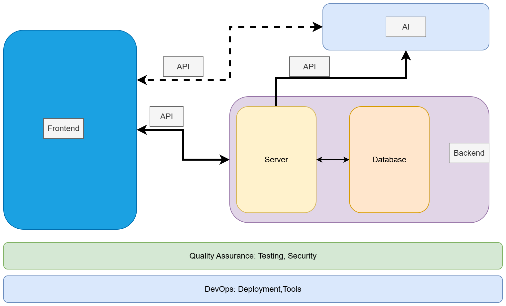

# Sprint 1: Deadline 2025-11-07

- [Deliverables](#deliverables)
- [Assessment Criteria](#assessment-criteria)
- [Considerations](#considerations)
- [Block Diagram Fullstack Application](#block-diagram-fullstack-application)
- [Project Ideas](#project-ideas)

---

### Deliverables

1. Prototype:
   - [Low-fidelity]
   - Tools: [Figma](https://www.figma.com/) or [Draw.io](https://app.diagrams.net/) 
2. Project description:
   - The title of the project
   - The names of the members
   - The target users and other stakeholders
   - The main functionality of the application.
   - Describe the user stories and Product backlog: You might consider using [Trello](https://trello.com/) 
3. Share your insights on the Sprint ceremonies:
   - Daily Scrum
   - Sprint Review
   - Retrospective
   - More on [Scrum](https://www.scrum.org/learning-series/what-is-scrum/)
4. Make sure to include each member’s contributions to this sprint.
5. Presentation: Here’s a [template for a 10-12-minute presentation](./ppt-template1.md) to help you structure your content effectively.

> When a group presents their sprint, two other groups will be assigned to ask questions and engage with the presentation.

----

### Assessment Criteria 

For the first sprint, the assessment criteria are not stringent. Groups can earn the maximum points by **making a 10-12-minute group presentation** and **submitting the required deliverables** to GitHub.

Bonus points can be earned if:
- The product backlog is generated according to the DEEP principle.
- User stories are based on the INVEST principle.
- The use of [Retrospective templates](https://agilebox.app/blog/4ls-retrospective/)

----

### Considerations

- When working with Figma, consider saving a local copy of the Figma file.
  - *You can save a local copy of a file in the .fig (Figma Design), .jam (FigJam), or .deck (Figma Slides) formats: `File > Save local copy `*
- Utilize [Trello](https://trello.com/) to organize user stories and manage the product backlog.
- Consider using LLM e.g ChatGPT for:
  - Generating user stories and evaluating them in alignment with the **INVEST** principle
  - Constructing a product backlog and Assessing tasks with respect to the **DEEP** principle

----

### Block Diagram Fullstack Application

---

### Project Ideas

> **If you don’t already have a project idea**, you can consider one of the following MERN fullstack + AI‑powered applications.  
> These are **examples to inspire your group** — you may use one as‑is, adapt it, or take it in a completely new direction.

#### Detailed Ideas

- [Note‑taking Web App](./ideas/note.md)
- [AI‑Powered Blogging Platform](./ideas/blog.md)
- [E‑commerce Store with Admin Dashboard](./ideas/e-commerce.md)
- [URL Shortening API Landing Page](./ideas/url.md)
- [Bookmarks](./ideas/bookmarks.md)
- [E‑Learning Platform](./ideas/e-learning.md)
- [A cloud‑based storage and collaboration](./ideas/fylo.md)
- [Job Listings with Filtering](./ideas/jobs.md)
- [Additional Brainstorming Ideas](./ideas/other.md)

[Low-fidelity]:https://www.invisionapp.com/inside-design/low-fi-vs-hi-fi-prototyping/ 

<!-- 
user stories referred to as tickets:
https://www.jacobparis.com/content/agile-ticketing 
-->

<!-- 
- **AI Job Board & Career Assistant**: Develop a **MERN job board platform** where employers post jobs and seekers apply. Add **LLM API features** like resume/job matching, AI-generated resume improvement suggestions, and an interview-prep chatbot. 
-->